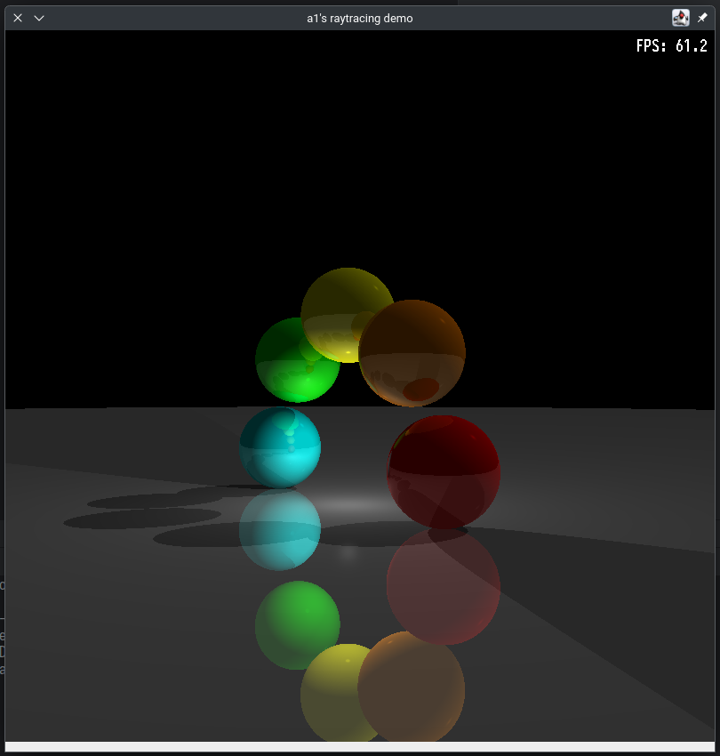
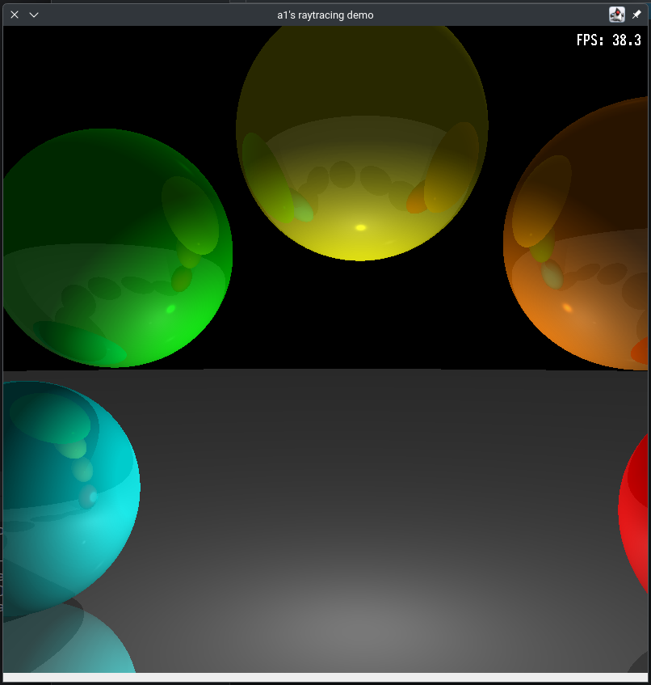
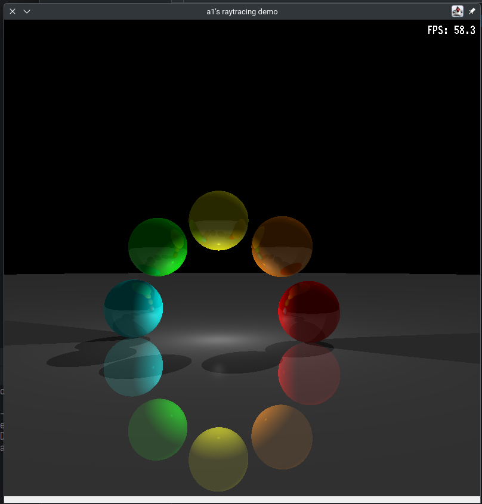

# Java Raytracer demo

Everyone needs to write a raytracer, right?

So this is a simple real-time raytracer written in Java with a Swing-based interactive UI. Move the camera with WASD,
zoom with = and -, and quit with Q or ESC. The scene features 8 colored spheres arranged in a circle, a ground plane, 
and multiple light sources (point, directional, and ambient).

The project is just a prototype, and doesn't do proper double buffering. That's why there can be some artifacts
during redrawing.

## Features
- Real-time multi-core rendering,
- Interactive camera movement and zoom,
- Scene with multiple spheres, ground, and lights.

## Controls
- **W, A, S, D**: Move camera
- **= / -**: Zoom in/out
- **Q or ESC**: Quit
- **[** and **]**: Rotate camera

## Screenshots







## Build & Run

```
./gradlew shadowJar
java -jar build/libs/jtracer-1.0-SNAPSHOT-all.jar
```

Tested only on Linux X11 + KDE.

## License
Public domain.

## Credits

Gabriel Gambetta (https://gabrielgambetta.com)